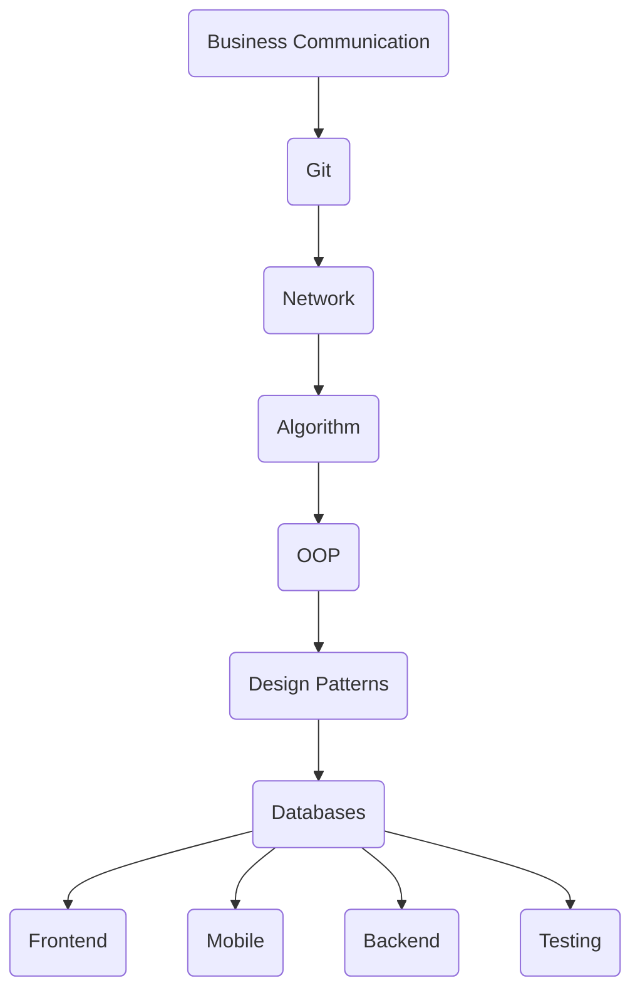

# Fundamentals

```mermaid
graph TD
    business-communication(Business Communication) --> git(Git)
    git --> network(Network)
    network --> algorithm(Algorithm)
    algorithm --> oop(OOP)
    oop --> patterns(Design Patterns)
    patterns --> databases(Databases)
    databases --> frontend(Frontend)
    databases --> mobile(Mobile)
    databases --> backend(Backend)
    databases --> testing(Testing)

%% Skills
click business-communication "ArtemySinitsa/labs/blob/main/skills/business-communication/readme.md"
click git "ArtemySinitsa/labs/blob/main/skills/git/readme.md"
click network "ArtemySinitsa/labs/blob/main/skills/network/readme.md"
click algorithm "ArtemySinitsa/labs/blob/main/skills/algorithm/readme.md"
click oop "ArtemySinitsa/labs/blob/main/skills/oop/readme.md"
click patterns "ArtemySinitsa/labs/blob/main/skills/patterns/readme.md"
click databases "ArtemySinitsa/labs/blob/main/skills/databases/readme.md"

%% Roadmaps
click frontend "ArtemySinitsa/labs/blob/main/roadmaps/frontend/readme.md"
click testing "ArtemySinitsa/labs/blob/main/roadmaps/testing/readme.md"
click mobile "ArtemySinitsa/labs/blob/main/roadmaps/mobile/readme.md"
click backend "ArtemySinitsa/labs/blob/main/roadmaps/backend/readme.md"

```