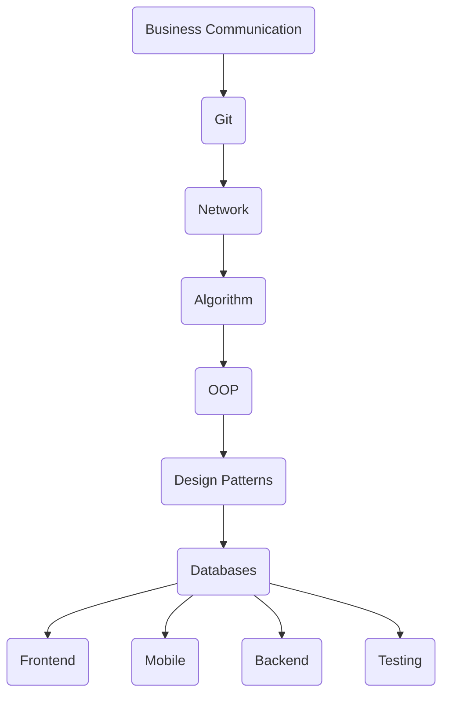

# Fundamentals

```mermaid
graph TD
    business-communication(Business Communication) --> git(Git)
    git --> network(Network)
    network --> algorithm(Algorithm)
    algorithm --> oop(OOP)
    oop --> patterns(Design Patterns)
    patterns --> databases(Databases)
    databases --> frontend(Frontend)
    databases --> mobile(Mobile)
    databases --> backend(Backend)
    databases --> testing(Testing)

%% Skills
click git "../skills/git/readme.md"
click network "../skills/network/readme.md"
click algorithm "../skills/algorithm/readme.md"
click oop "../skills/oop/readme.md"
click patterns "../skills/patterns/readme.md"
click databases "../skills/databases/readme.md"

%% Roadmaps
click frontend "../frontend/readme.md"
click testing "../testing/readme.md"
click mobile "../mobile/readme.md"
click backend "../backend/readme.md"

```