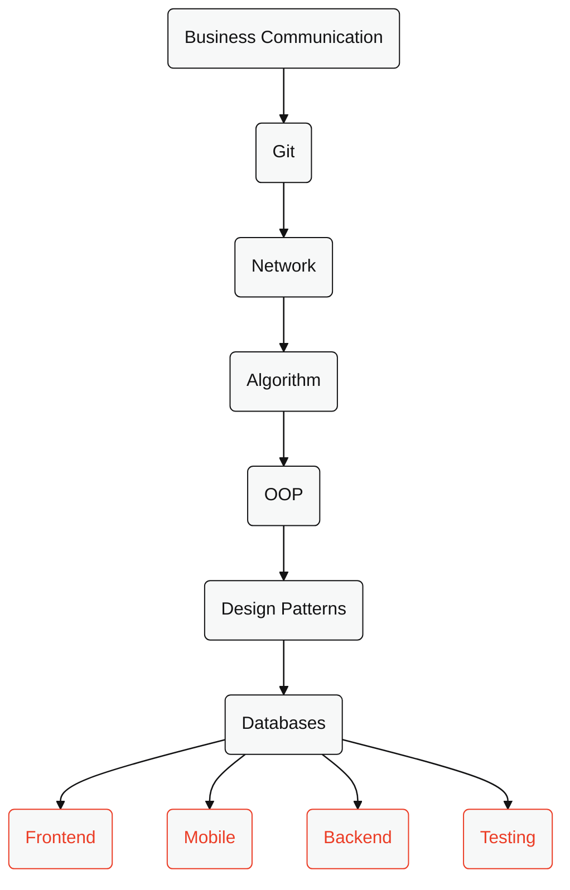

# Fundamentals

## Skills
* [Business Communication](../../business-communication/readme.md)
* [Git](../../skills/git/readme.md)
* [Network](../../skills/network/readme.md)
* [Algorithm](../../skills/algorithm/readme.md)
* [OOP](../../skills/oop/readme.md)
* [Design Patterns](../../skills/patterns/readme.md)
* [Databases](../../skills/databases/readme.md)

## Roadmap 

