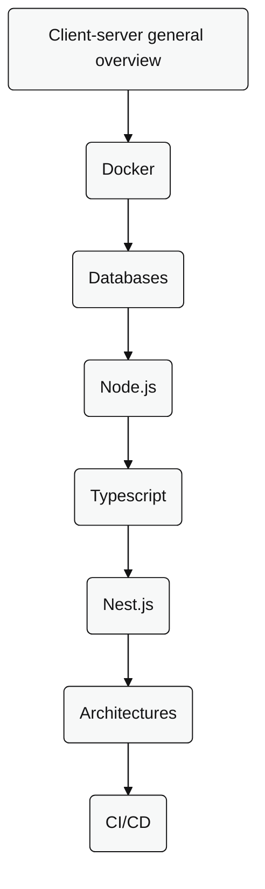

# Node.js backend

## Skills

- [Backend overview](../../skills/nodejs-backend/readme.md)
- [Docker](../../skills/docker/readme.md)
- [Databases](../../skills/databases/readme.md)
- [Node.js](../../skills/nodejs-backend/nodejs/readme.md)
- [Typescript](../../skills/typescript/readme.md)
- [Nest.js](../../skills/nodejs-backend/nest/readme.md)
- [Architectures](../../skills/nodejs-backend/architectures/readme.md)
- [CI/CD](../../skills/nodejs-backend/cicd/readme.md)
- Enterprise techniques

## Roadmap

